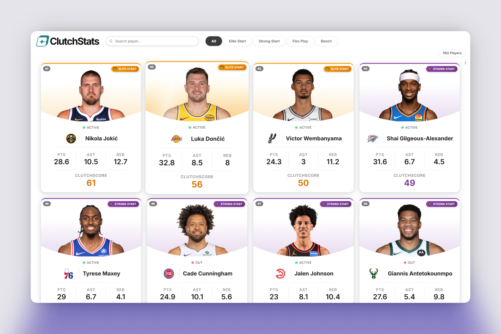
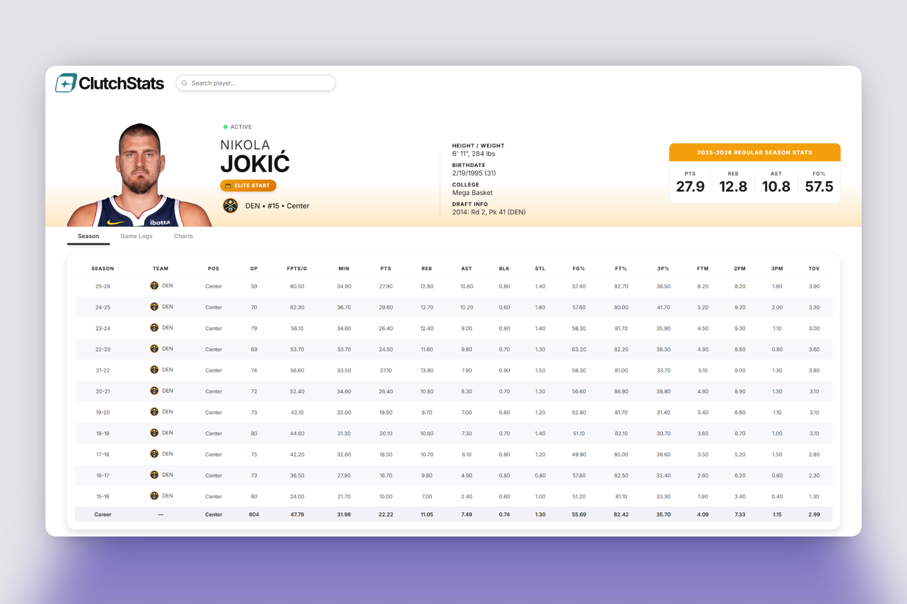

# 🏀 ClutchStats

A full-stack NBA fantasy analytics app that ranks every player in the league using a custom scoring engine called **ClutchScore** — built for fantasy GMs who want fast, data-driven start/sit decisions.




---

## Features

| | |
|:---|:---|
| 📊 | Player rankings with tier badges — Elite Start, Strong Start, Flex Play, Bench |
| 🚑 | Live injury status pulled from ESPN |
| 👤 | Player profiles with career stats, game logs, and performance charts |
| 🔍 | Search with autocomplete and tier filtering |
| 📅 | Auto-detects the current NBA season — no manual updates needed |

---

## Tech Stack

| | |
|:---|:---|
| **Frontend** | React 19, React Router, Chart.js, Vite |
| **Backend** | Node.js, Express |
| **Data** | NBA Stats API, ESPN Injuries API |

---

## Deployment

Live at **[clutchstats.vercel.app](https://clutchstats.vercel.app/)** — frontend on Vercel, backend on Render.

> **Note:** The first load may take 30–60 seconds — Render spins down after inactivity and needs a moment to wake up.

---

## Running Locally

You'll need two terminals — one for the frontend, one for the backend.

**1. Clone and install**
```bash
git clone https://github.com/awcodes22/ClutchStats.git
cd ClutchStats
npm install --legacy-peer-deps
```

**2. Create a `.env` file in the project root**
```
VITE_API_URL=http://localhost:5000
```

**3. Start the backend**
```bash
node server.js
```

**4. Start the frontend**
```bash
npm run dev
```

Open `http://localhost:5173` in your browser.

---

## Tests

```bash
npm test
```

Covers the core scoring engine — `calculateESPNScore`, `assignTier`, and `getRankedPlayers`.

---

## How ClutchScore Works

Modeled after ESPN H2H Points league settings:

| Stat | Points |
|:---|---:|
| Points | +1 |
| Rebounds | +1.2 |
| Assists | +1.5 |
| Steals | +3 |
| Blocks | +3 |
| 3-Pointers Made | +1.5 |
| Missed FG | -0.5 |
| Missed FT | -0.5 |
| Turnovers | -1 |

| Tier | ClutchScore |
|:---|---:|
| 👑 Elite Start | 50+ |
| ⚡ Strong Start | 40 – 49 |
| 🔀 Flex Play | 30 – 39 |
| 🪑 Bench | Below 30 |
